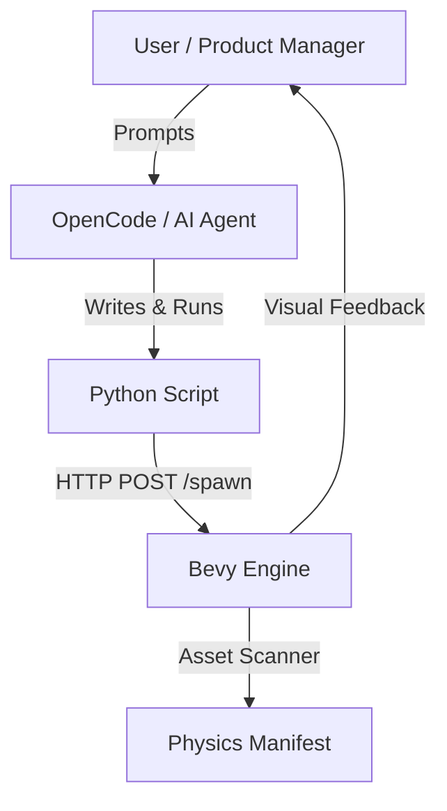

# Bevy AI Editor

An experimental **Remote Level Editor** plugin for the [Bevy](https://bevyengine.org/) game engine.

This project is designed to be the **"Hands"** for an AI Agent. It allows AI models (like **OpenCode**) to manipulate a 3D game world by writing and executing Python code.


[](https://crates.io/crates/bevy_ai_editor)


## 🌟 Why this exists? (The OpenCode Workflow)

This tool bridges the gap between **LLM Code Generation** and **Game Engines**.

- **Traditional Workflow**: You manually drag-and-drop objects in an editor.
- **Procedural Workflow**: You write complex algorithms to generate levels.
- **OpenCode Workflow**: You tell the AI **"Make a spooky forest with a cabin in the center"**, and the AI:
    1.  Writes a Python script using `BevyAiClient`.
    2.  Calculates positions, rotations, and layout logic.
    3.  Executes the script to build the scene in real-time.

In this architecture:
- **Bevy**: The **Canvas** (Renderer & Physics).
- **Python**: The **Brush** (API & Logic).
- **OpenCode**: The **Artist** (Intelligence & Control).

## 🚀 Features

- **HTTP JSON API**: Simple REST API listening on port `15703`.
- **Remote Spawning**: Spawn GLTF models or builtin shapes remotely.
- **Auto Physics**: Automatically generates **Avian3D** colliders (Capsule, Cuboid, Trimesh).
- **Snap-to-Ground**: Objects automatically snap to the terrain.
- **Asset Scanner**: Auto-scans `assets/models` and generates a manifest for physics inference.

## 📦 Architecture



## 🛠️ Quick Start

### 1. Run the Bevy App (The Canvas)

```bash
cargo run --example simple_app
```

### 2. Let OpenCode Draw (The Artist)

You can now ask OpenCode (or write Python yourself):

> *"I see you have `tree.glb` and `house.glb` in the assets. Write a python script using `BevyAiClient` to create a circular village with 5 houses and trees surrounding them."*

Or run the demos manually:

```bash
python examples/demos/demo_01_grid.py
python examples/demos/demo_02_forest.py
```

## 🐍 Python Client API

The `BevyAiClient` (`python/bevy_ai_client.py`) is what OpenCode uses to interact with the world:

```python
from python.bevy_ai_client import BevyAiClient

client = BevyAiClient()

# Spawn a builtin red cube
client.spawn("builtin://cube/red", x=0, y=5, z=0)

# Spawn a GLTF model (path relative to assets/)
client.spawn("models/nature/tree.glb", x=10, z=10, rotation=1.57)

# Save the current scene
client.save_scene("my_cool_level.json")
```

## 📂 Project Structure

```
bevy_ai_editor/
├── assets/             # Game assets (models, textures)
├── examples/           # Rust examples and Python demos
├── python/             # Python client library
│   └── bevy_ai_client.py
├── src/                # Rust Source Code
│   ├── lib.rs          # Plugin core & HTTP server
│   └── scanner.rs      # Asset auto-scanner
└── Cargo.toml          # Rust dependencies
```

## 📝 Configuration

```rust
app.insert_resource(AiEditorConfig {
    http_port: 15703,
    manifest_path: "assets/asset_manifest.json".to_string(),
    save_dir: "assets/levels".to_string(),
});
```

## 📄 License

MIT License
