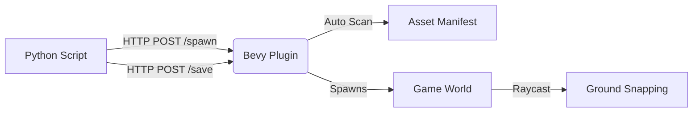

# Bevy AI Editor

An experimental **Remote Level Editor** plugin for the [Bevy](https://bevyengine.org/) game engine.

This plugin allows you to manipulate your 3D scene in **real-time** using external scripts (Python, etc.) via a lightweight HTTP API. It is designed for:

- 🤖 **AI-Assisted Level Generation**: Use Python's rich ecosystem (NumPy, PyTorch) to procedurally generate levels.
- 🎮 **Remote Debugging**: Spawn and move objects without recompiling Rust code.
- 📐 **Rapid Prototyping**: Script scene layouts instantly.


## 🚀 Features

- **HTTP JSON API**: Simple REST API listening on port `15703` (configurable).
- **Remote Spawning**: Spawn GLTF models or builtin shapes (Cube, Sphere, Capsule) remotely.
- **Auto Physics**: Automatically generates **Avian3D** colliders (Capsule, Cuboid, Trimesh) based on mesh analysis.
- **Snap-to-Ground**: Objects can automatically snap to the terrain using raycasts.
- **Asset Scanner**: Auto-scans `assets/models`, computes AABBs, and generates a manifest file for physics inference.
- **Scene Persistence**: Save your generated level to JSON (`assets/levels/`).

## 📦 Architecture



1. **Rust Side**: The `AiEditorPlugin` starts a background HTTP server thread.
2. **Python Side**: The `BevyAiClient` sends JSON commands to the server.
3. **Synchronization**: Commands are sent via channels (`flume`) to the main Bevy thread to ensure thread safety.

## 🛠️ Quick Start

### 1. Prerequisites

- **Rust**: Install via [rustup.rs](https://rustup.rs/).
- **Python**: Install Python 3.x and the `requests` library:
  ```bash
  pip install requests
  ```

### 2. Run the Bevy App

Run the included example app which has the plugin enabled:

```bash
cargo run --example simple_app
```

*You should see a window with a green ground plane. Controls: WASD to move, Right Click to rotate.*

### 3. Run the Python Script

In a separate terminal, run one of the demos:

```bash
# Demo 1: Spawn a grid of objects
python examples/demos/demo_01_grid.py

# Demo 2: Procedural Forest Generation
python examples/demos/demo_02_forest.py
```

*Watch as objects magically appear in your Bevy window!*

## 🐍 Python Client API

The `BevyAiClient` class (`python/bevy_ai_client.py`) provides a simple interface:

```python
from python.bevy_ai_client import BevyAiClient

client = BevyAiClient()

# Spawn a builtin red cube
client.spawn("builtin://cube/red", x=0, y=5, z=0)

# Spawn a GLTF model (path relative to assets/)
client.spawn("models/nature/tree.glb", x=10, z=10, rotation=1.57)

# Save the current scene
client.save_scene("my_cool_level.json")
```

## 📂 Project Structure

```
bevy_ai_editor/
├── assets/             # Game assets (models, textures)
├── examples/           # Rust examples and Python demos
│   ├── simple_app.rs   # Main Rust entry point example
│   └── demos/          # Python scripts (grid, forest, etc.)
├── python/             # Python client library
│   └── bevy_ai_client.py
├── src/                # Rust Source Code
│   ├── lib.rs          # Plugin core & HTTP server
│   └── scanner.rs      # Asset auto-scanner & physics inference
└── Cargo.toml          # Rust dependencies
```

## 📝 Configuration

You can configure the plugin resources in your Bevy app:

```rust
app.insert_resource(AiEditorConfig {
    http_port: 15703,
    manifest_path: "assets/asset_manifest.json".to_string(),
    save_dir: "assets/levels".to_string(),
});
```

## 🤝 Contributing

Contributions are welcome! Feel free to open issues or submit PRs.

## 📄 License

MIT License
